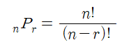
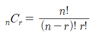

### 순열(permutation)

서로 다른 n개 중에 r개를 선택하는 수(순서 고려 X)

예시) 1에서 10에서 3개를 뽑을 때 아래 경우는 모두 다른 경우

[1,3,5],[3,5,1],[5,3,1],[1,5,3],[3,1,5],[5,1,3]

### 조합(combination)

서로 다른 n개 중에 r개를 선택하는 수(순서 고려 O)

예시) 1에서 10에서 3개를 뽑을 때 아래 경우는 모두 같은 경우

[1,3,5],[3,5,1],[5,3,1],[1,5,3],[3,1,5],[5,1,3]

