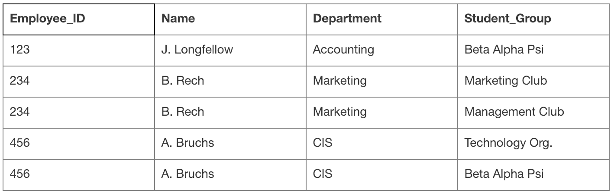
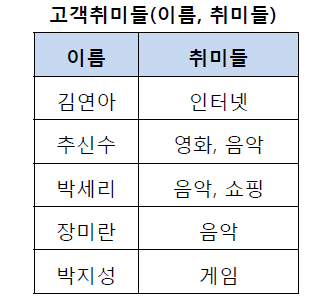
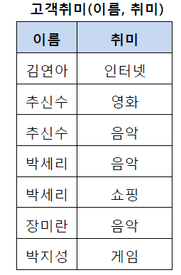
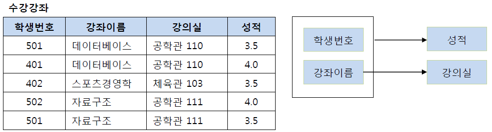
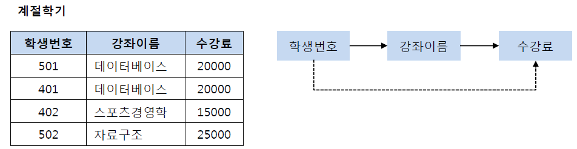
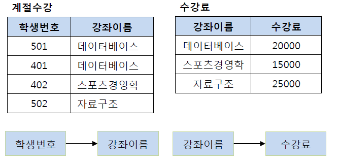

### 이상 현상(Anomaly)

이상 현상은  테이블내의 **데이터 중복성에 의해서 발생되는 데이터 불일치 현상**으로  3가지가 있다.

1. 갱신 이상 : 반복된 데이터 중에 일부를 갱신 할 시 데이터의 불일치가 발생한다.
2. 삽입 이상 : 불필요한 정보를 함께 저장하지 않고서는 어떤 정보를 저장하는 것이 불가능하다.
3. 삭제 이상 : 필요한 정보를 함께 삭제하지 않고서는 어떤 정보를 삭제하는 것이 불가능하다.

#### 예시

- 갱신 이상: 만약에 `A. Bruchs`의 부서가 CIS에서 Marketing으로 바뀌었다고 가정해보자. 
  테이블의 4, 5번째 행의 CIS를 둘 다 바꾸지 않고 하나만 바꾼다면 `A.Bruchs`의 부서는 어느 부서에 속해있는지 알 수 없게 된다.
- 삽입 이상: 새로운 부서 Engineering이 신설되었고 아직 근무자는 없다고 가정해보자. 
  하지만 이 부서에 관련한 정보는 불필요한 정보(Name, Student_Group)를 함께 입력하지 않는 한 위 테이블에 입력할 수 없다.
- 삭제 이상: 만약에 Accounting 부서에 속한 사람이 `J.Longfellow` 단 한 명이라고 가정하자.
   `J.Longfellow`의 정보(첫번째 행)를 삭제하면 Accounting 부서에 대한 정보도 사라지게 된다.

### 정규화(**Normalization**)

테이블 간에 중복된 데이터를 허용하지 않는다는 것. 이상 현상을 방지한다.
중복된 데이터를 허용하지 않음으로써 무결성(Integrity)를 유지할 수 있으며, DB의 저장 용량 역시 줄일 수 있다.

##### 제1 정규화

테이블의 컬럼이 원자값(Atomic Value, 하나의 값)을 갖도록 테이블을 분해하는 것

여기서 추신수 박세리는 2개의 취미를 가지고 있기 때문에 제1 정규형을 만족하지 못한다.

그래서 제1 정규화해서 분해할 수 있다.

##### 제2 정규화

제1 정규화를 진행한 테이블에 대해 **완전 함수 종속**을 만족하도록 테이블을 분해하는 것

> 완전 함수 종속 : 기본키의 부분집합이 결정자가 되어선 안된다는 것

이 테이블에서 기본키는 **학생번호**와 **강좌이름** 으로 복합키이다. 
성적은 기본키의 부분집합인 학생번호에 결정될 수 있다.
강의실은 기본키의 부분집합인 강좌이름에 결정될 수 있다.

그렇기 때문에 아래처럼 강의실을 분해하여 별도의 테이블로 관리해 제2 정규형을 만족할 수 있다.

##### 제3 정규화

제2 정규화를 진행한 테이블에 대해 **이행적 종속**을 없애도록 테이블을 분해하는 것

> 이행적 종속 :  A -> B, B -> C가 성립할 때 A -> C가 성립되는 것을 의미

위 테이블에서 학생 번호 -> 강좌 이름, 강좌 이름 -> 수강료를 결정하고 있다.

그래서 (학생 번호, 강좌 이름) 과 (강좌 이름, 수강료)를 분해해야 한다.

제3 정규화를 하는 이유는 특정 학생이 강좌를 변경하면 그에 맞게 수강료도 변경해야하기 때문이다.

