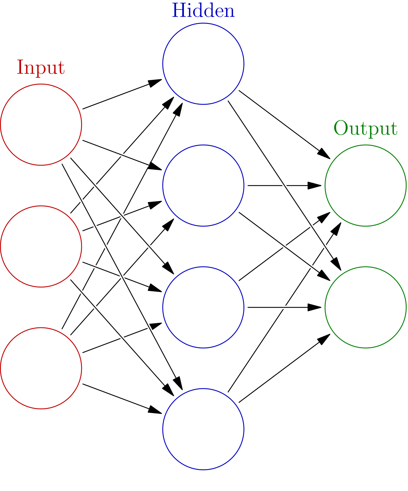
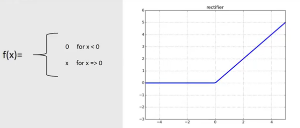

# 3장 신경망

> `퍼셉트론`으로 복작한 함수도 표현할 수 있다.
>
> But, `가중치`를 설정하는 작업이 필요하다.

>`신경망`은 퍼셉트론의 문제를
>
>`가중치`의 적절한 값을 데이터로부터 자동으로 학습하는 능력으로 해결해준다.

### 신경망의 예

> 신경망의 모양



### 활성화 함수

> 입력 신호의 총합을 출력신호로 변환하는 함수 `활성화 함수` 
>
> 입력 신호의 총합이 활성화를 일으키는지를 정하는 역할


> 위 식과 그림에서 `a = b + w1x1 + w2x2` 이고, `a` 는 활성화 함수`h` 를 통과하여 `y` 로 변환한다.
>
> `h` 는 `a` 의 값에 따라 `y` 의 값을 결정한다.

### 시그모이드 함수

> 일반적인 시그모이드 함수의 그림과 식

 


> 파이썬 코드로 구현한 시그모이드 함수

```python
import numpy as np
import matplotlib.pylab as plt


def sigmoid(x):
    return 1 / (1 + np.exp(-x))    

X = np.arange(-5.0, 5.0, 0.1)
Y = sigmoid(X)
plt.plot(X, Y)
plt.ylim(-0.1, 1.1)
plt.show()
```


### 계단 함수 구현하기

> 일반적인 계단 함수의 모양과 식


> 파이썬 코드로 구현한 계단 함수

```python
import numpy as np
import matplotlib.pylab as plt

# 계단함수
def step_function(x):
    return np.array(x > 0, dtype=np.int)


X = np.arange(-5.0, 5.0, 0.1)
Y = step_function(X)
plt.plot(X, Y)
plt.ylim(-0.1, 1.1)  # y축의 범위 지정
plt.show()
```

### 시그모이드 함수, 계단 함수 비교

> 계단 함수는 출력이 `갑자기 `바뀌지만 시그모이드 함수는 `부드럽게 `바뀐다.

>`비선형 함수`라는 공통점이 있다.
>
>신경망에서 활성화 함수는 비선형 함수만 사용해야 하는데 `선형 함수`를 이용하면 층을 깊게하는 의미가 없기 때문이다. 

### ReLU 함수

> ReLU 함수의 모양과 식



> 파이썬 구현 코드

```python
import numpy as np
def relu(x):
    return np.maximum(0, x)
```

### 다차원 배열

> 다차원배열의 생성 및 차원과 형태

```python
# %%
import numpy as np

# 1차원 배열생성
A = np.array([1, 2, 3, 4])
# 1차원 배열의 차원 정보와 형태
print(np.ndim(A)) # 1
print(A.shape) # (4,)

# 2차원 배열생성
A = np.array([[1, 2], [3, 4]]
# 2차원 배열의 차원 정보와 형태
print(np.ndim(A)) # 2
print(A.shape) # (2,2)
             
# 3차원 배열생성
A = np.array([[[1, 2], [3, 4],],[[1, 2], [3, 4],]])
# 3차원 배열의 차원 정보와 형태
print(np.ndim(A)) # 3
print(A.shape) # (2,2,2)
```

> 주의할 점은 1차원 배열의 shape는 값이 1개이지만 `Tuple` 형식이다.

>행렬의 곱은 두 행렬의 대응 하는 차원의 원소 수가 일치해야한다.
>
>N1 x M1 * N2 x M2일 때, M1 과 N2는 원소 수가 같아야한다.  

```python
# 정상적인 연산
A = np.array([[1, 2, 3], [4, 5, 6]])
print(A.shape) # (2,3)
B = np.array([[1, 2], [3, 4], [5, 6]])
print(B.shape) # (3,2)
print(np.dot(A, B))
```

```python
# 연산이 불가능한 형태
A = np.array([[1, 2,], [4, 5]])
print(A.shape) # (2,2)
B = np.array([[1, 2], [3, 4], [5, 6]])
print(B.shape) # (3,2)
print(np.dot(A, B))
```

> 이처럼 다차원 배열의 곱을 계산할 때 np.dot을 사용하면 쉽게 계산을 할 수 있다.

