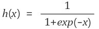
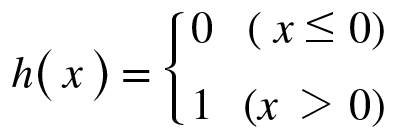
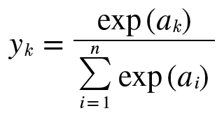

# 3장 신경망

> `퍼셉트론`으로 복작한 함수도 표현할 수 있다.
>
> But, `가중치`를 설정하는 작업이 필요하다.

>`신경망`은 퍼셉트론의 문제를
>
>`가중치`의 적절한 값을 데이터로부터 자동으로 학습하는 능력으로 해결해준다.

### 신경망의 예

> 신경망의 모양


### 활성화 함수

> 입력 신호의 총합을 출력신호로 변환하는 함수 `활성화 함수` 
>
> 입력 신호의 총합이 활성화를 일으키는지를 정하는 역할


> 위 식과 그림에서 `a = b + w1x1 + w2x2` 이고, `a` 는 활성화 함수`h` 를 통과하여 `y` 로 변환한다.
>
> `h` 는 `a` 의 값에 따라 `y` 의 값을 결정한다.

### 시그모이드 함수

시그모이드 함수는 선형값에서 비선형 값을 얻기위해 사용하기 시작했다.

> 일반적인 시그모이드 함수의 그림과 식

 




> 파이썬 코드로 구현한 시그모이드 함수

```python
import numpy as np
import matplotlib.pylab as plt


def sigmoid(x):
    return 1 / (1 + np.exp(-x))    

X = np.arange(-5.0, 5.0, 0.1)
Y = sigmoid(X)
plt.plot(X, Y)
plt.ylim(-0.1, 1.1)
plt.show()
```


### 계단 함수 구현하기

> 일반적인 계단 함수의 모양과 식




> 파이썬 코드로 구현한 계단 함수

```python
import numpy as np
import matplotlib.pylab as plt


# 계단함수
def step_function(x):
    return np.array(x > 0, dtype=np.int)


X = np.arange(-5.0, 5.0, 0.1)
Y = step_function(X)
plt.plot(X, Y)
plt.ylim(-0.1, 1.1)  # y축의 범위 지정
plt.show()
```

### 시그모이드 함수, 계단 함수 비교

> 계단 함수는 출력이 `갑자기 `바뀌지만 시그모이드 함수는 `부드럽게 `바뀐다.

>`비선형 함수`라는 공통점이 있다.
>
>신경망에서 활성화 함수는 비선형 함수만 사용해야 하는데 `선형 함수`를 이용하면 층을 깊게하는 의미가 없기 때문이다. 

*비선형 선형 함수 값 비교하기*

```python
# 선형
import numpy as np 
def linear(x):
    return x * 2


def equation(x):
    return x ** 2 + x + 1


X = 1
index = 0
while index < 10:
    A = equation(X)
    X = linear(A)
    print(X)
    index += 1
```

```python
# 비선형
import numpy as np
def sigmoid(x):
    return 1 / (1 + np.exp(-x))


def equation(x):
    return x ** 2 + x + 1


X = 1
index = 0
while index < 10:
    A = equation(X)
    X = sigmoid(A)
    print(X)
    index += 1
"""   
6
86
14966
447992246
401394105848233526
322234456419405800240845360957252406
207670089807819871887216346024063239123147277189489203650099699500082486
86253732401575942068293156996045296392635312257988145791288926116113190423102272379579669129537249257166686511956795784768136295451240608045366
14879412706405343061750809139957547640334763268087188297544386011388297957929996642646374629319780257608859244184510956989645700712366437999865953066561145305605900016729347857560671255233759499942951538700043497001270524732558631510596957257732988573849797416640233606774156175444238646
442793844975073551685544334486880107183985686470348440233771777436265704576563772095402985374122623622422049264328875204115354789304707913933231510162595517574393707599358991776896265527545418932724610209638673775978320515227890748890397779689632809825340133317092139893973994392181597549420626460066161759858383372094953762832644345659703914575487676841539341357816829726147576824306133278204634459814962122419027477006181047801816943563548226431065587226277426261804755405430302397143926819138639403660404773430775740256121304655862065978119586249918731841164500088303926
"""
```


### ReLU 함수

> ReLU 함수의 모양과 식


> Relu vs. Leaky Relu


> 파이썬 구현 코드

```python
import numpy as np
def relu(x):
    return np.maximum(0, x)
```

### 다차원 배열

> 다차원배열의 생성 및 차원과 형태

```python
# %%
import numpy as np

# 1차원 배열생성
A = np.array([1, 2, 3, 4])
# 1차원 배열의 차원 정보와 형태
print(np.ndim(A)) # 1
print(A.shape) # (4,)

# 2차원 배열생성
A = np.array([[1, 2], [3, 4]]
# 2차원 배열의 차원 정보와 형태
print(np.ndim(A)) # 2
print(A.shape) # (2,2)
             
# 3차원 배열생성
A = np.array([[[1, 2], [3, 4],],[[1, 2], [3, 4],]])
# 3차원 배열의 차원 정보와 형태
print(np.ndim(A)) # 3
print(A.shape) # (2,2,2)
```

> 주의할 점은 1차원 배열의 shape는 값이 1개이지만 `Tuple` 형식이다.

>행렬의 곱은 두 행렬의 대응 하는 차원의 원소 수가 일치해야한다.
>
>N1 x M1 * N2 x M2일 때, M1 과 N2는 원소 수가 같아야한다.  

```python
# 정상적인 연산
A = np.array([[1, 2, 3], [4, 5, 6]])
print(A.shape) # (2,3)
B = np.array([[1, 2], [3, 4], [5, 6]])
print(B.shape) # (3,2)
print(np.dot(A, B))
```

```python
# 연산이 불가능한 형태
A = np.array([[1, 2,], [4, 5]])
print(A.shape) # (2,2)
B = np.array([[1, 2], [3, 4], [5, 6]])
print(B.shape) # (3,2)
print(np.dot(A, B))
```

> 이처럼 다차원 배열의 곱을 계산할 때 np.dot을 사용하면 쉽게 계산을 할 수 있다.

### 3층 신경망 구현

> 아래 이미지처럼 3층으로 이루어진 실제 신경망 구현해보기


```python
import numpy as np

# 1층 신경망
# 시그모이드 함수 -> h()
def sigmoid(x):
    return 1 / (1 + np.exp(-x))

X = np.array([1.0, 0.5]) # 입력층 정의 -> x1, x2
W1 = np.array([[0.1, 0.2, 0.3], [0.4, 0.5, 0.6]]) # 1층 가중치 정의 -> w11 ~ w32
B1 = np.array([0.2, 0.4, 0.8]) # 편향 정의 -> b1, b2, b3
A1 = np.dot(X, W1) + B1 # 곱연산 -> a1, a2, a3
Z1 = sigmoid(A1) # 활성화함수 통과 -> z1, z2, z3
print(Z1)
print(Z1.shape)
```


```python
# 2층 신경망
W2 = np.array([[0.1, 0.2,], [0.4, 0.5,], [0.3, 0.6]])
B2 = np.array([0.5, 0.3])
A2 = np.dot(Z1, W2) + B2
Z2 = sigmoid(A2)
print(Z2)
print(Z2.shape)
```


```python
# 출력층의 활성화 함수
def identity_function(x):
    return x


# 3층 신경망
W3 = np.array([[0.1,0.3], [0.4,0.2]])
B3 = np.array([0.5,0.3])
A3 = np.dot(Z2, W3) + B3
Y = identity_function(A3) # -> y1, y2
print(Y)
print(Y.shape)
```

### 소프트맥스 함수

>항등함수`y = x`는 입력을 그대로 출력한다.
>
>`분류`에서는 소프트맥스 함수 `softmax function` 을 사용한다.




`n`은 출력층의 뉴런 수, `y_k`는 k번째 출력을 뜻한다. 

분자 `a_k`는 k번째 입력의 지수함수 뜻하고, 분모는 모든 입력의 지수함수의 합을 뜻한다. 

> 결국 소프트맥스 `k번째 입력/전체 입력 합` 는 k 번째의 확률을 나타낸다고 볼 수 있다. 
>
> 이미지를 보면 모든 출력층은 모든 입력 신호에 영향을 받는걸 알 수 있다.

> 소프트맥스 코드 구현

```python
import numpy as np 

a = np.array([0.3, 2.9, 4.0])
exp_a = np.exp(a)
print(exp_a)

sum_exp_a = np.sum(exp_a)
print(sum_exp_a)

y = exp_a / sum_exp_a
print(y)
```

> 소프트맥스 코드 구현시 문제점

```python
import numpy as np

a = np.array([0.3, 2.9, 4.0])
exp_a = np.exp(a)
print(exp_a) # -> [ 1.34985881 18.17414537 54.59815003]

sum_exp_a = np.sum(exp_a)
print(sum_exp_a) # -> 74.1221542101633

y = exp_a / sum_exp_a
print(y) # -> [0.01821127 0.24519181 0.73659691]

b = np.array([1000, 1010, 990])
exp_b = np.exp(b)
print(exp_b) # -> [inf inf inf]

sum_exp_b = np.sum(exp_b)
print(sum_exp_b) # -> inf

y = exp_b / sum_exp_b
print(y) # -> [nan nan nan]

c = np.array([10, 20, 30])
exp_c = np.exp(c)
print(exp_c) # -> [2.20264658e+04 4.85165195e+08 1.06864746e+13]

sum_exp_c = np.sum(exp_c)
print(sum_exp_c) # -> 10686959768746.338

y = exp_c / sum_exp_c
print(y) # -> [2.06106005e-09 4.53978686e-05 9.99954600e-01]

# 지수함수 때문에 값이 너무 커지거나 무한대의 값이 나오는데 이럴경우 나눗셈의 결과가 불안정하거나 계산 자체를 할 수가 없다.
```

> 문제점 개선하기


1. 분모와 분자에 `C`를 곱한다.
2. `C`를 지수함수 안으로 옮겨 `logC`로 만든다. `logC` 는 `C'`로 치환한다.
3. 식이 뜻하는 의미는 지수함수를 계산할 때 어떤 정수를 더하거나 빼도 같은 결과가 나온다는 것이다. 
4. `C'`에 어떤 값이 들어가도 상관없지만 `overflow`막기위해 `a`의 값 중 가장 큰 값을 이용해 빼기 연산을 해준다.  

```python
# 개선한 소프트 맥스 코드

def softmax(a):
    c = np.max(a)
    exp_a = np.exp(a - c)  # 오버플로 대책
    sum_exp_a = np.sum(exp_a)
    y = exp_a / sum_exp_a

    return y

a = np.array([0.3, 2.9, 4.0])
y = softmax(a) 
print(y) # -> [0.01821127 0.24519181 0.73659691]

b = np.array([1000, 1010, 990])
y = softmax(b)
print(y) # -> [4.53978686e-05 9.99954600e-01 2.06106005e-09] 문제 개선

c = np.array([10, 20, 30])
y = softmax(c)
print(y) # -> [2.06106005e-09 4.53978686e-05 9.99954600e-01]
```

> 소프트 맥스는 모든 결과 값`y`을 다 더했을 때 1이 나온다는 중요한 성질이 있다.
>
> 이러한 성질때문에 소프트 맥스의 결과를 `확률`로 해석할 수 있고, 이러한 특징 때문에 분류 모델에서 사용된다.

```python
a =y np.array([0.3, 2.9, 4.0])
y = softmax(a)
print(np.sum(y)) # -> 1

b = np.array([1000, 1010, 990])
y = softmax(b)
print(np.sum(y)) # -> 1

c = np.array([10, 20, 30])
y = softmax(c)
print(np.sum(y)) # -> 0.999999...
```

> 다만, 소프트맥스를 적용했을 때 각 원소의 대소관계는 변하지 않는데 `a`의 대소관계가 곧 `y`의 대소관계라는 의미이다.
>
> 이러한 특성때문에 소프트맥스 함수는 학습시에는 사용되지만 `지수 함수의 연산`을 생략하기 위해서 실제 추론`inference` 에서는 사용되지 않는다. 
>
> 학습을 할 때는 최적의 가중치`w` 를 구하기 위해서 소프트 맥스를 사용을 하지만 추론 단계에서는 최적의 가중치`w`를 사용해서 예측을 하기 때문에 소프트맥스를 사용하지 않아도 된다.
>
> 출력층의 뉴런`y` 수는 예측할려는 문제에 맞게 적절하게 정해야한다. 만약 이미지를 숫자 0 ~ 9 중 하나로 예측하는 문제라면 뉴런을 10개로 설정해야한다.


### 손글씨 숫자 인식 모델

> 손글씨 숫자 분류 모델을 만들어보자.

```python
from dataset.mnist import load_mnist
import pickle
import numpy as np


# 소프트맥스 함수
def softmax(a):
    c = np.max(a)
    exp_a = np.exp(a - c)
    sum_exp_a = np.sum(exp_a)
    y = exp_a / sum_exp_a

    return y


# 시그모이드 함수
def sigmoid(x):
    return 1 / (1 + np.exp(-x))


# 가중치(w),편향(b) 불러오기
def init_network():
    with open("sample_weight.pkl", "rb") as f:
        # 학습된 가중치 매개변수가 담긴 파일
        network = pickle.load(f)
        
        # network 구조
        # w1,w2,w3,b1,b2,b3 -> 3개의 은닉층
        # b1 shape : (50,1) 
        # b2 shape : (100,1)
        # b3 shape : (10,1)
        # w1 shape : (784,50)
        # w2 shape : (50,100)
        # w3 shape : (100,10)
        
    return network


def get_data():
    # _train : 학습용 데이터, 사용 X
    # _test : 검증용 데이터, 사용 O
    # flatten = True : 2차원 데이터를 1차원으로 펼치기 28 x 28 => 784
    # normalize = True : 정규화 => 0 ~ 255 값을 0 ~ 1 값으로 치환
    # one_hot_label = False : 레이블 원핫인코딩 수행 X 
    # 원핫인코딩 : 만약 값이 7 이면 [0,0,0,0,0,0,0,1,0,0] 로 변경
    (x_train, t_train), (x_test, t_test) = load_mnist(
        flatten=True, normalize=True, one_hot_label=False
    )
    return x_test, t_test


def predict(network, x):
    W1, W2, W3 = network["W1"], network["W2"], network["W3"] # 가중치 설정
    b1, b2, b3 = network["b1"], network["b2"], network["b3"] # 편향치 설정
    # 첫번째 은닉층
    a1 = np.dot(x, W1) + b1
    z1 = sigmoid(a1)
    # 두번째 은닉층
    a2 = np.dot(z1, W2) + b2
    z2 = sigmoid(a2)
    # 세번쨰 은닉층 -> 출력
    a3 = np.dot(z2, W3) + b3
    # 마지막 출력 활성화 함수에서 소프트 맥스를 쓰지 않아도 같은 결과가 나올 것인가?
    # 테스트 결과 y를 반환한 적중률과 a3를 반환한 적중률이 동일하다.
    y = softmax(a3)

    return y


# 데이터셋 불러오기 
x, t = get_data()
# 가중치 불러오기
network = init_network()
accuracy_cnt = 0
# 배치 사이즈 설정
batch_size = 100

for i in range(0, len(x), batch_size):
    # batch size 만큼 입력 데이터를 가져온다 batch size * 784
    x_batch = x[i : i + batch_size]
    # print(x_batch.shape, i)
    # 예측을 수행한 결과를 저장한다. batch size * 10 -> 0 ~ 9 에서 각 숫자일 확률 리스트
    y_batch = predict(network, x_batch)
    # 0 ~ 9 에서 가장 높은 확률의 인덱스를 저장한다.
    p = np.argmax(y_batch, axis=1)
    # 예측 값 p 와 실제 값 t 와 비교해서 같은(True) 개수의 합계를 누적
    accuracy_cnt += np.sum(p == t[i : i + batch_size])

# 맞춘 개수 / 전체 개수 : 맞춘 확률
print("Accuracy:" + str(float(accuracy_cnt) / len(x)))  # Accuracy:0.9352?
```


### 배치처리

> 원래의 계산 흐름


> 배치사이즈 `batch_size`가 100일 때 계산흐름


> 배치처리는 계산 시간을 대폭 줄여준다.  두 가지 이유가 있다
>
> 1. `Numpy`는 작은 배열을 계산할 때 보다 큰 배열을 계산할 때 효율적으로 계산할 수 있게 최적화 되어있다.
> 2. 한 번에 많은 데이터를 읽으면 데이터를 읽는 횟수가 줄어들어서 `계산을 수행하는 비율이 늘고, 데이터를 읽는 비율이 줄어들어 `시간이 줄어든다.
>
> 결과적으로 `큰 배열을 적은 횟수`로 계산을 하기 때문에` 작은 배열을 많은 횟수`로 계산할 때보다 시간이 줄어든다.
>
> 다만, `batch size` 가 클수록 한 번에 하는 연산량이 많아지는데 요구하는 컴퓨터 성능이 높아진다.


