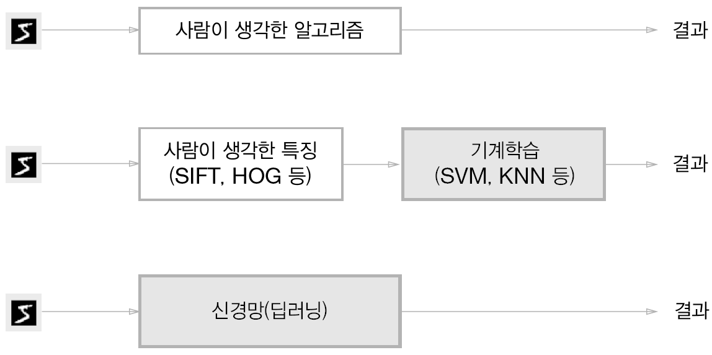

# 4장 신경망 학습

> `신경망`의 특징은 데이터를 보고 학습할 수 있다는 점이다.
> 그 말은 즉, 데이터를 보고 자동으로 가중치를 결정한다는 뜻이다.

### 4.1.1 데이터 주도 학습

`기계학습`은 데이터가 생명이다. 데이터가 없으면 아무것도 시작할 수 없다.

`기계학습`에서는 데이터에서 규칙을 찾아내는 역할을 `기계`가 담당하지만 이미지에서 벡터로 변환할 때 사용하는 특징은 여전히 `사람`이 설계해야한다.

> 기계학습과 신경망(딥러닝)

> 이처럼 신경망`딥러닝`은 이미지에 포함된 중요한 특징까지 `기계`가 스스로 학습한다.

### 4.1.2 훈련 데이터와 시험데이터

기계학습에서는 데이터를 훈련 데이터`training data`와 시험 데이터`test data`로 나눠 수행하는 것이 일반적이다.

1. 우선 훈련 데이터만 사용하여 최적의 매개변수`weight`를 찾는다.
2. 시험 데이터를 사용하여 모델의 성능을 평가한다.

이렇게 데이터를 나누는 이유는 `범용`적인 모델을 얻기 위해서이다.` 범용능력`은 아직 보지 못한 데이터도 올바르게 문제를 풀어내는 능력이다.

> 참고로 한 데이터셋에만 지나치게 최적화된 상태를 오버피팅`overfittinng` 이라고 한다.

---

## 4.2 손실 함수

`손실함수`란 신경망의 성능지표이다. 일반적으로는 `오차제곱합`과 `교차 엔트로피 오차`를 사용한다.

> 손실함수는 신경망 성능의 나쁨을 나타내는 지표이다. 

### 4.2.1 오차제곱합

`y_k`는 신경망의 출력, `t_k`는 정답 레이블, `k`는 데이터의 차원수

`오차제곱합` = sum((각 원소의 추정값 - 실제값) ** 2) / 2

 ### 4.2.2 교차 엔트로피 오차

`log`는 자연로그 `y_k`는 출력 `t_k`는 정답이다. 여기서 `t`는 정답 인덱스만 1이고 나머지는 0이다. 실질적으로 정답일 때의 자연로그를 계산하는 식이다.

예를들어 정답이 '2'가 정답이고, 출력이 0.6 이면 교차 엔트로피 오차는 `-log0.6 = 0.51` 이다.

> 자연로그의 그래프

> 그래프를 보면 x 가 1에 가까워질수록 y의 값은 작아진다.