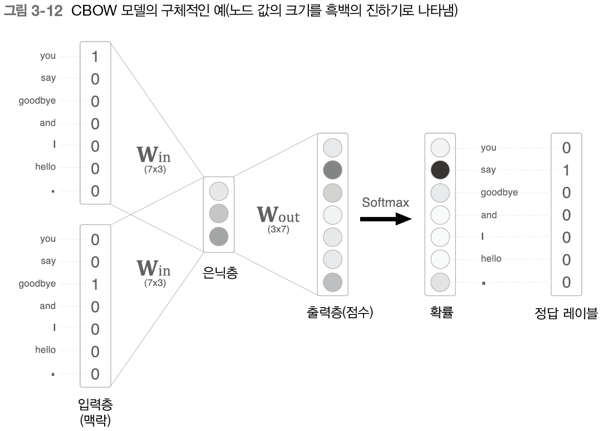

# 3장 word2vec

## 3.1 추론 기반 기법과 신경망

### 3.1.1 통계 기반 기법의 문제점

현업에서 다루는 말뭉치의 어휘 수는 100만을 훌쩍 넘는다고 한다.

어휘가 100만 개라면, `통계 기반 기법`에서는 `100만 X 100만` 이라는 거대한 행렬이 만들어 진다.

이는 현실적으로 `❗불가능`하다.

💡 반면에 `추론 기반 기법`은 신경망을 이용해서 미니배치로 학습하는 것이 일반적이기 때문에 말뭉치가 거대하더라도 학습시킬 수 있다.

게다가 여러 머신과 여러 GPU를 이용한 병렬 계산으로 학습 속도도 높일 수 있다.


### 3.1.2 추론 기밥 기법 개요

💡 추론 기반 기법에서는 `추론`이 주된 작업이다.

`추론`이란 아래 그림처럼 맥락이 주어졌을 때 "?"에 들어갈 단어를 추측하는 작업이다.


---

아래 그림처럼 추론 기반 기법에는 어떤 모델이 등장한다. 이 모델로 신경망을 사용한다.

모델은 맥랑 정보를 입력받으면 단어의 출현 확률을 보여준다.


### 3.1.3 신경망에서의 단어처리

신경망은 "you"나 "say" 같은 단어를 있는 그대로 처리할 수 없기 때문에 `고정 길이 벡터`로 변환해야 한다.

💡대표적인 방법이 단어를 `원핫 벡터`로 변환하는 것이다.

아래 그림처럼 원핫 벡터는 벡터의 원소 중 하나만 1이고 나머지는 0인 벡터를 말한다.


---

이처럼 단어를 고정 길이 벡터로 변환하면 신경망의 입력층은 아래 그림처럼 뉴런의 수를 `고정`할 수 있다.


위 그림에서 입력층의 뉴런은 총 7개이고, 7개의 뉴런은 7개의 각각의 단어와 대응한다.

---

💡 신경망의 계층은 `벡터`를 처리할 수 있고, 단어를 `벡터`로 나타낼 수 있기 때문에 신경망을 통해 단어를 처리할 수 있다는 뜻이다.

즉, 아래 그림처럼 완전연결계층을 만들 수 있다.


```python
# 완전연결계층 구현

import numpy as np

# 입력
c = np.array([[1, 0, 0, 0, 0, 0, 0]])
# 가중치
W = np.random.randn(7, 3) 
# 행렬곱
h = np.matmul(c, W) 
print(h) # [[0.42004167 0.53941578 0.31298182]]
```

위의 코드에서 c는 `원핫 표현`으로 단어 ID에 대응하는 원소만 1이고, 나머지는 0이다.

그래서 c 와 W의 행렬곱에서 하나의 행만 사용하고, 나머지는 사용하지 않는 것과 같다.

> 위 코드는 MatMul 계층으로 대체할 수 있다.

```python
import numpy as np

# MatMul 계층
class MatMul:
    def __init__(self, W):
        self.params = [W]
        self.grads = [np.zeros_like(W)]
        self.x = None

    def forward(self, x):
        (W,) = self.params
        out = np.dot(x, W)
        self.x = x
        return out

    def backward(self, dout):
        (W,) = self.params
        dx = np.dot(dout, W.T)
        dW = np.dot(self.x.T, dout)
        self.grads[0][...] = dW
        return dx


c = np.array([[1, 0, 0, 0, 0, 0, 0]])
W = np.random.randn(7, 3)
layer = MatMul(W)
h = np.matmul(c)
print(h)
```


## 3.2 단순한 word2vec

word2vec에서 제안하는 `CBOW` 모델을 사용해 신경망을 구축해보자

### 3.2.1 CBOW 모델의 추론 처리

💡 CBOW 모델은 맥락으로부터 타깃을 추측하는 신경망이다.(타깃은 중앙 단어이고, 주변 단어가 맥락이다.)

CBOW 모델의 입력은 "you"와 "goodbye" 같은 맥락이다.


CBOW 모델의 입력층은 2개가 있고, 은닉층을 거쳐 출력층에 도달한다.

입력층에서 은닉층으로의 변환과 은닉층에서 출력층 뉴런으로의 변환은 완전연결계층이 처리한다.

> 위 그림에서 입력층이 2개인 이유는 맥락으로 사용할 단어를 2개로 정했기 때문이다. 만약 N개를 사용하면 입력층이 N개가 된다.

---

위의 그림에서 은닉층의 뉴런은 입력층의 완전연결계층에 의해 변환된 값이다.

만약 입력층이 여러 개이면 전체를 평균을 한다.

예를들어 입력층 두 개가 변화한 값 `h1, h2`가 있다면 은닉층 뉴런은 `(h1 + h2) / 2 `가 된다.

---

출력층의 뉴런은 7개인데 이 뉴런 하나 하나가 각 단어에 대응한다.

💡뉴런의 각 값은 단어에 대한 `점수(확률)`를 뜻하며, 값이 클수록 단어의 출현 확률도 높아진다. 

---

위 그림에서 입력층에서 은닉층으로의 변환은 완전연결계층에 의해서 이뤄지는데 가중이 `W_in`은 7 X 3 행렬이며 이 가중치가 `단어의 분산 표현`이다.


💡가중치 W_in의 각행에는 해당` 단어의 분산 표현`이 저장돼 있다고 볼 수 있다.

따라서 학습을 할수록 맥락에서 출현하는 단어를 잘 추측하는 방향으로 이 분산 표현들이 갱신된다.

> 분산 표현 : RGB = (255,123,0) 처럼 단어를 표현하는 것

---

위 그림은 CBOW 를 계층 관점에서 본 그림이다.

모델의 가장 앞단에는 2개의 MatMul 계층`행렬곱`이 있고, 다음으로 두 계층이 더한 후 0.5를 곱해서 평균을 구해준다. 

마지막 출력층에서 다른 MatMul 계층이 적용되어 `점수(확률)`을 구한다.

---

```python
import sys

sys.path.append("..")
import numpy as np
from common.layers import MatMul


# 샘플 맥락 데이터
# 입력 2개
c0 = np.array([[1, 0, 0, 0, 0, 0, 0]])
c1 = np.array([[0, 0, 1, 0, 0, 0, 0]])

# 가중치 초기화
W_in = np.random.randn(7, 3)
W_out = np.random.randn(3, 7)

# MatMul 계층 생성
in_layer0 = MatMul(W_in)
in_layer1 = MatMul(W_in)
out_layer = MatMul(W_out)

# 순전파
# 두 개의 입력에 대한 행렬곱 순전파 값
h0 = in_layer0.forward(c0)
h1 = in_layer1.forward(c1)

# 평균 계산
h = 0.5 * (h0 + h1)
s = out_layer.forward(h)
print(s)
#[[ 0.61767154 -0.07400862 -0.00912255  0.67955864 -0.18225631 -0.10688905 -0.71444076]]
```

### 3.2.2 CBOW 모델의 학습

💡CBOW 모델을 통해 얻은 점수에 소프트 맥스 함수를 적용하면 `확률`을 얻을 수 있다.

이 `확률`은 맥락(전후 단어)가 주어졌을 때 중아에 어떤 단어가 출현할지에 대한 확률이다.



위의 그림에서 맥락은 `you`와 `goodbye`이고, 정답레이블(단어)은 `say`이다.

---

CBOW 의 학습은 올바른 예측을 할 수 있도록 가중치를 조정한다. 그 결과로 가중치 W 에 단어의 출현 패턴을 파악한 벡터가 학습된다. 

>CBOW 모델은 단어 출현 패턴을 사용한 말뭉치로부터 배운다. 말뭉치가 다르면 얻게되는 분산 표현도 달라진다는 의미이다.
>
>즉, 스포츠 기사를 사용한 경우와 경제 기사를 사용했을 때 얻게되는 분산 표현이 크게 다를 것이다.

CBOW 모델은 `다중 클래스 분류`를 수행하는 신경망이다.

이 신경망을 학습하려면 `소프트맥스`와 `교차 엔트로피 오차`만 이용하면 된다.

소프트맥스는 `점수를 확률`로 변환하고, 확률과 정답 레이블로부터 교차 엔트로피 오차를 구한 후 `손실함수 값`을 사용해 학습을 진행한다.

