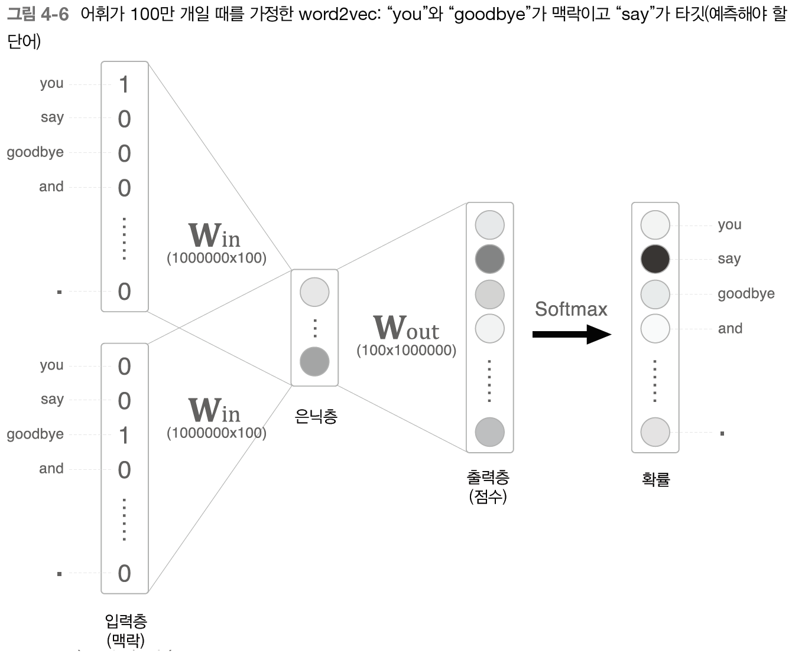
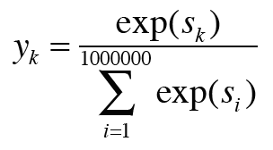
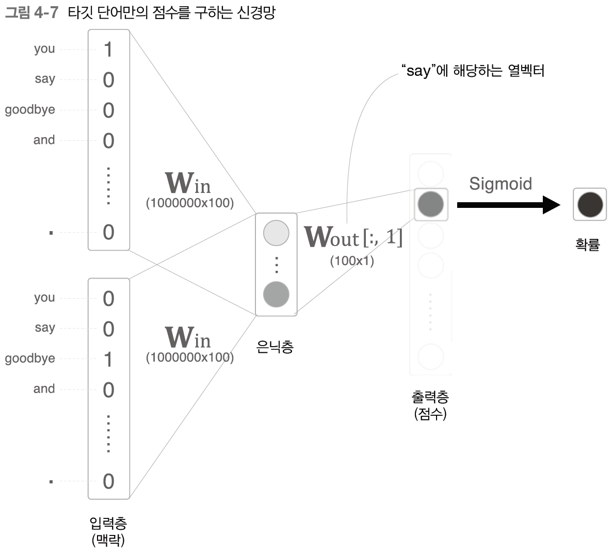
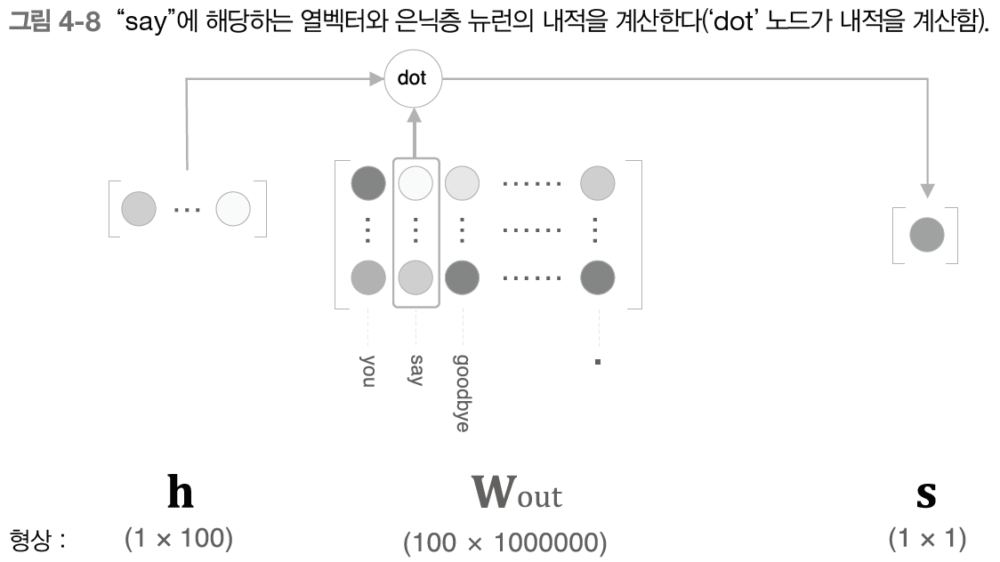
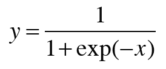
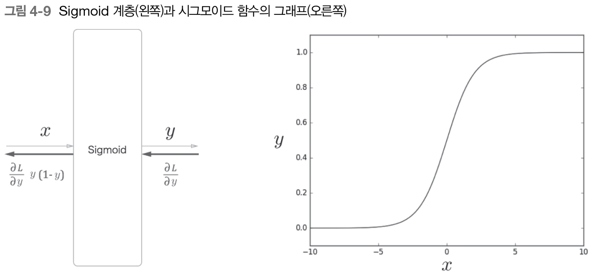
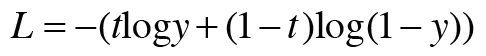

``

# 4장 word2vec 속도 개선 [github](https://github.com/WegraLee/deep-learning-from-scratch-2)

👍앞장의 `word2vec`에 두 가지 개선을 추가해서 속도를 개선해보자

1. `Embedding` 이라는 계층을 도입한다.
2. `네거티브 샘플링`이라는 새로운 손실 함수를 도입한다.

## 4.1 word2vec 개선 1

`CBOW`는 거대한 말뭉치를 다루게 되면 몇 가지 문제가 발생한다.


위 그림에서는 입력층과 출력층에 각 100만 개의 뉴런이 존재한다. 많은 뉴런 때문에 중간 계산에 `많은 시간`이 소요된다.

정확히는 다음의 두 계산이 병목이 된다.

1. 입력층의 원핫 표현과 가중치 행렬 $W~in$  의 곱 계산
2. 은닉층과 가중치 행렬 $W~out$의 곱 및 Softmax 계층의 계산

첫 번째는 입력층의 원핫 표현의 문제이다. 

어휘가 100만 개라면 한 어휘의 원핫 표현의 원소 수가 100만 개의 벡터가 된다. 상당한 메모리를 차지하고, 이 원핫 벡터와 $W~in$을 곱하면 `계산 자원을 상당히 소모`한다.

두 번째는 은닉층 이후의 계산이다.

마찬가지로 은닉층과 $W~out$의 곱의 계산량이 아주 많고, Softmax 계층에서도 계산량이 증가한다.

### 4.1.1 Embedding 계층

앞 장의 word2vec 에서는 `단어의 원핫 표현`과 `가중치 행렬`과 곱했다.

만약 어휘 수가 100만개 은닉층 뉴런이 100개라면 아래 그림과 같은 행렬곱이 발생한다.


그런데 `행렬곱`이 하는 일은 단지 `가중치 행렬`에서 `특정 행`을 추출할 뿐이다. 그러므로 `행렬곱`은 사실 필요가 없다.

이처럼 `단어 ID에 해당하는 특정 행 추출`을 하는 계층을 `Embedding 계층`이라고 부른다.

### 4.1.2 Embedding 계층 구현 

```python
class Embedding:
    def __init__(self, W):
        self.params = [W]
        self.grads = [np.zeros_like(W)]
        self.idx = None

    def forward(self, idx):
        # 가중치 행렬
        W, = self.params
        
        # 단어 id
        self.idx = idx
        
        # 가중치 행렬에서 단어 id에 해당하는 행 추출
        out = W[idx]
        return out

    def backward(self, dout):
        # 가중치 기울기 행렬
        dW, = self.grads
        
        # 전체 원소 값 0으로
        dW[...] = 0
        
        # 가중치 기울기 행렬의 특정 행(단어 id)에 기울기 dout을 할당
        np.add.at(dW, self.idx, dout)
        return None
```


#### 순전파

`가중치 행렬(W)`에서  `단어 ID(idx)`에 해당하는 특정 행을 추출한 후, 다음 층으로 전달한다.

#### 역전파

`가중치 기울기 행렬(dW)` 의 원소를 모두 0으로 초기화하고, `특정 행(idx)`에  이전 층에서 온 `기울기(dout)`을 `더해준다`.

> 더해주는 이유는 중복 idx가 있을 때 먼저 나온 idx 행의 값을 덮어쓰게 되고, 기울기 소실이 발생한다.


## 4.2 word2vec 개선 2

`네거티브 샘플링`을 이용해서 `은닉층 이후 처리`의 병목을 해결하자.

### 4.2.1 은닉층 이후 계산의 문제점



`은닉층 이후`에서 계산이 오래 걸리는 곳은 두 곳이다.

1. 은닉층의 뉴런과 가중치 행렬($W~out~$) 의 곱
2. Softmax 계층의 계산

첫 번째는 거대한 행렬을 곱하는 문제이다. 위 그림에서는 은닉층의 뉴런 벡터 크기는`100`이고, 가중치 행렬의 크기는 `100 X 100만`이다. 이 두 행렬을 곱하기 위해서는 많은 시간이 소모된다.

두 번째는 Softmax 계층은 어휘가 많아질수록 계산량이 많아진다는 점이다.



위 식은 k번째 단어를 타깃으로 했을 때의 Softmax 계산이다.

분모 값을 얻으려면 exp 계산을 `100만`번 수행해야한다.

### 4.2.2 다중 분류에서 이진 분류로

네거티브 샘플링의 핵심 아이디어는 `이진 분류`에 있다.

✅정확하게는 `다중 분류`를 `이진 분류`로 근사하는 것이 중요한 포인트이다.

지금까지는 `100만 개의 단어 중`에서 `하나`의 옳은 단어를 선택하는 문제였다.

이 문제를 `타깃 단어가 X 인가?`에 대한 질문에 `Yes/No`로 대답할 수 있는 신경망을 생각해야한다.



`이진 분류`로 접근하면 신경망 계층을 위 그림처럼 나타낼 수 있다.

은닉층과 출력 층의 $W~out~$의 내적은

✅ `하나의 특정 단어 벡터`만 추출하고,  그 벡터와 은닉층 뉴런의 내적을 계산하면 된다.

> 그림에서의 특정 단어는  `say`



위 그림처럼 $W~out~$에는 각 단어 ID의 단어 벡터가 각각의 열로 저장되어 있다.

`say`에 대한 단어 벡터를 추출해서 은닉층 뉴런과의 내적을 구하면 `say`에 대한 최종 점수인 것 이다.

### 4.2.3 시그모이드 함수와 교차 엔트로피 오차

`이진 분류`를 신경망으로 해결할려면 `시그모이드 함수`를 적용해 확률로 변환하고, `교차 엔트로피 오차`를 손실 함수로 사용한다.

> 시그모이드 공식과 계층, 그래프





✅`시그모이드 함수`를 적용해 `확률 y`를 얻으면, 이 `교차 에트로피 오차`를 사용해 확률 y로부터 손실을 구한다.

> 교차 엔트로피 오차 공식
>
> y : 시그모이드 함수 출력, t : 정답 레이블(1 또는 0)




위 그림에서 주목할 것은 `역전파의 y-t`이다.

만약, 정답 레이블`t`이 1이라면, 확률`y`가 1에 가까워질수록 오차가 줄어든다는 뜻이다.

반대로 확률`y`가 1로부터 멀어지면 오차가 커진다.

오차가 `작다면 작게` 학습하고, `크다면 크게` 학습할 것이다.

### 4.2.4 다중 분류에서 이진 분류로 구현

