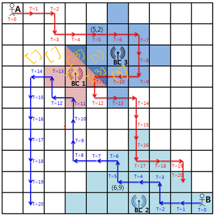

# 5644. 무선 충전

### 풀이

아래 그림 처럼 BFS`를 사용해서 각 BC의 인덱스`index`를 `graph`의 각 좌표 리스트에 추가한다. 



`A, B`를 이동시키면서 각 좌표에서의 충전 영역`powerA, powerB`을 가져온다.

둘 중 하나라도 충전 구역에 포함되면 

- `(BC 인덱스, 파워)`를 원소로 가지고, `파워`를 기준으로 내림차순 정렬을 한 리스트` list_charge_`를 만든다.
- 네 가지 기준에 따라 파워 값을 구한다.
  1. A 구역이 0개일 때 -> B 구역 중 가장 큰 값을 결과 변수`sum_battery` 에 더한다.
  2. B 구역이 0개일 때 -> A 구역 중 가장 큰 값을 결과 변수`sum_battery` 에 더한다.
  3. A, B가 1개 구역씩 가지고 있고, 같은 구역일 때 -> 그 구역의 값을 결과 변수에 더한다.
  4. 나머지의 경우 -> 이중 반복문으로 가장 큰 값을 가지는 조합을 구한다. 단, A B가 같은 BC 인덱스를 못가지게 한다.

### 코드

```python
# [모의 SW 역량테스트] 5644. 무선 충전
import sys

sys.stdin = open("input.txt", 'r')


def pprint(arr):
	for a in arr:
		print(*a)
	print("-" * 10)


from collections import deque

dx = [0, 0, 1, 0, -1]
dy = [0, -1, 0, 1, 0]


def sort_list_charge(index_list):
	lst = []
	for index in index_list:
		lst.append((index, battery_chargers[index - 1][3]))

	lst.sort(reverse=True, key=lambda x:x[1])
	return lst


def draw_charge_range(index, x, y, c):
	queue = deque()
	queue.append((y, x, 0))
	visit = set()
	visit.add((y, x))
	while queue:
		y, x, count = queue.popleft()

		# 충전 범위 벗어나면 종료
		if count > c:
			return

		# 충전 영역 추가
		if graph[y][x] == []:
			graph[y][x] = [index]
		else:
			graph[y][x].append(index)

		for i in range(1, 5):
			ny = y + dy[i]
			nx = x + dx[i]

			if 1 <= ny <= 10 and 1 <= nx <= 10 and (ny, nx) not in visit:
				visit.add((ny, nx))
				queue.append((ny, nx, count + 1))


T = int(input())

for t in range(T):
	graph = [[[]] * 11 for _ in range(11)]
	# 이동 시간(M), BC의 개수(A)
	M, A = list(map(int, input().split()))

	userA = list(map(int, input().split()))
	userB = list(map(int, input().split()))

	# BC 정보는 좌표(X, Y), 충전 범위(C), 처리량(P)
	battery_chargers = [list(map(int, input().split())) for _ in range(A)]

	# 그래프에 충전 정보 추가
	for index, (x, y, c, p) in enumerate(battery_chargers):
		draw_charge_range(index + 1, x, y, c)

	x_A = y_A = 1
	x_B = y_B = 10
	sum_battery = 0
	for i in range(M + 1):
		powerA = graph[y_A][x_A]
		powerB = graph[y_B][x_B]

		# 둘 중 하나가 충전구역에 있을 때
		if len(powerA) + len(powerB) > 0:
			list_charge_A = sort_list_charge(powerA)
			list_charge_B = sort_list_charge(powerB)

			# A 구역이 0개 일 때
			if len(list_charge_A) == 0:
				sum_battery += list_charge_B[0][1]

			# B 구역이 0개 일 때
			elif len(list_charge_B) == 0:
				sum_battery += list_charge_A[0][1]

			# 둘 다 0개가 아닐 때
			else:
				# 두 개가 1개씩 가지고 있는데 같은 구역일 때
				if list_charge_A == list_charge_B and len(list_charge_A) == 1 and len(list_charge_B) == 1:
					sum_battery += list_charge_A[0][1]
				else:
					max_val = 0
					for index_A, power_A in list_charge_A:
						for index_B, power_B in list_charge_B:
							if index_A != index_B:
								sum_val = power_A + power_B
								if sum_val > max_val:
									max_val = sum_val
					sum_battery += max_val

		if i == M:
			break

		x_A += dx[userA[i]]
		y_A += dy[userA[i]]

		x_B += dx[userB[i]]
		y_B += dy[userB[i]]

	print(f"#{t + 1} {sum_battery}")

```

