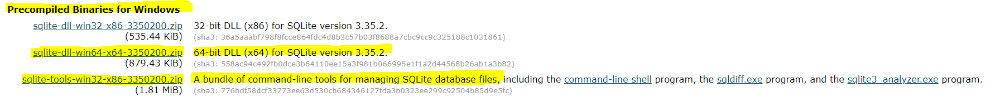
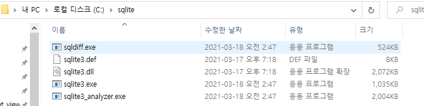
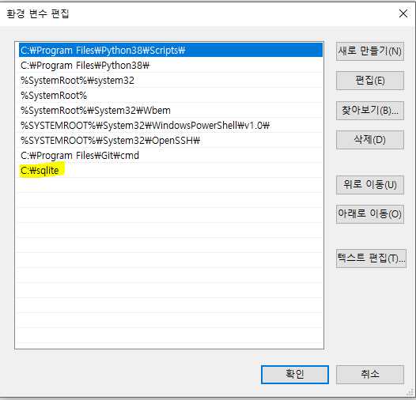

## SQL 문법 종류

| 분류                 | 개념        | 예시   |
| -------------------- | ----------- | ------ |
| DDL 데이터 정의 언어 | 데이터 정의 | CREATE |
| DML 데이터 조작 언어 |             |        |
| DCL 데이터 제어 언어 |             |        |


## sqlite3 설치

### 1. sqlite 공식 홈페이지

https://www.sqlite.org/download.html

### 2. zip 파일 2개 다운로드



### 3. C드라이브 - `sqlite` 폴더생성 후 압축풀기



### 4. 환경변수 편집 `시스템 변수 path`



### 5. 설치 확인

> 꼭 git bash 에서 확인

```bash
winpty sqlite3
```

### 6. alias 등록

> vim ~/.bashrc

```bash
alias sqlite3="winpty sqlite3"
```

> ESC -> :wq

```bash
source ~/.bashrc
sqlite3
```

 

## sqlite3 시작하기

### 1. 데이터베이스 불러오기 & 생성

#### 데이터베이스 불러오기

```bash
sqlite3 파일명.sqlite3
```

#### 데이터베이스 생성

```bash
sqlite3 파일명.sqlite3
```

```sqlite
.databases
```

### 2. csv 모드 전환

```sqlite
.mode csv
```

### 3. csv 파일 불러오기

> import csv파일명 table명

```sqlite
.import hellodb.csv users_user
```

> csv 파일 내용

```markdown
id,first_name,last_name,age,country,phone
1,길동,홍,600,충청도,010-2424-1232
```
