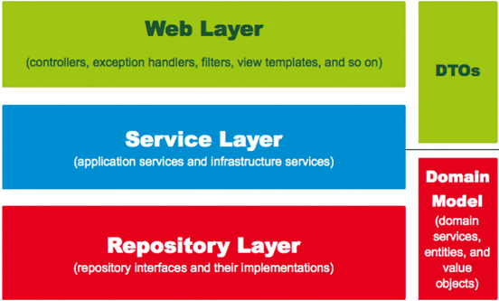

## JPA

자바 표준 ORM**`Object Relational Mapping`**

### Spring Data JPA

JPA는 인터페이스로서 구현체(Hibernate, Eclipse Link 등)가 필요하지만 Spring에서는 구현체를 직접 다루지 않는다.

대신 Spring Data JPA 모듈을 이용하여 JPA를 다룬다.

> Spring Data JPA > Hibernate > JPA 관계

### 의존성 등록

```
dependencies {
 
    // JPA
    // spring-boot-starter-data-jpa : 스프링 부트용 Spring Data Jpa 라이브러리
    // h2 : 인메모리 관계형 데이터베이스, 테스트용도로 많이 사용된다.
    implementation('org.springframework.boot:spring-boot-starter-data-jpa')
    implementation('com.h2database:h2')
}
```

## CRUD 

### domain 패키지 생성

> src > main> java > 패키지.domain

### posts 패키지 Posts 클래스 생성

> src > main > java > 패키지.domain.posts > Posts.java

### Posts 코드 작성

```java
package org.example.springboot.domain.posts;
import lombok.Builder;
import lombok.Getter;
import lombok.NoArgsConstructor;

import javax.persistence.Column;
import javax.persistence.Entity;
import javax.persistence.GeneratedValue;
import javax.persistence.GenerationType;
import javax.persistence.Id;

// @Getter : 각 필드 Getter 메소드 생성
// @Entity : 테이블이라는 것을 표시
// @NoArgsConstructor : 기본 생성자 자동 추가
@Getter
@NoArgsConstructor
@Entity  
public class Posts {
    // @Id : PK 필드 
    // @GeneratedValue : PK 생성 규칙
    // GenerationType.IDENTITY : auto_increment
    @Id 
    @GeneratedValue(strategy = GenerationType.IDENTITY) 
    private Long id;
    
    // @Column : 테이블의 컬럼을 나타냄. 굳이 사용하지 않아도 되지만 옵션을 지정하기 위해 사용해야한다.
    @Column(length=500,nullable = false) 
    private String title;

    @Column(columnDefinition = "TEXT", nullable = false)
    private String content;

    private String author;
	
    // Builder : 레코드 생성 패턴 클래스
    @Builder
    public Posts(String title,String content, String author){
        this.title = title;
        this.content = content;
        this.author = author;
    }
}
```

> Entity 클래스에는 절대 Setter 메소드를 만들지 않는다. 대신 목적과 의도를 나타낼 수 있는 메소드를 따로 추가한다.

### JpaRepository 생성 & 코드 작성

> 데이터베이스에 전근하게 해준다.

> src > main> java > 패키지.domain.posts > PostsRepository.java(인터페이스)

```java
package org.example.springboot.domain.posts;
import org.springframework.data.jpa.repository.JpaRepository;

// Posts,Long : Entity 클래스, PK 타입
// 기본적으로 CRUD 메소드가 자동으로 생성된다.
public interface PostsRepository extends JpaRepository<Posts,Long> {
}
```

### 테스트 코드 작성

> src > test > java > 패키지.domain.posts > PostsRepositoryTest.java

```java
package org.example.springboot.web.domain.posts;

import org.example.springboot.domain.posts.Posts;
import org.example.springboot.domain.posts.PostsRepository;
import org.junit.jupiter.api.AfterEach;
import org.junit.jupiter.api.Test;
import org.junit.jupiter.api.extension.ExtendWith;
import org.springframework.beans.factory.annotation.Autowired;
import org.springframework.boot.test.context.SpringBootTest;
import org.springframework.test.context.junit.jupiter.SpringExtension;

import java.util.List;

import static org.assertj.core.api.Assertions.assertThat;

@ExtendWith(SpringExtension.class)
@SpringBootTest
public class PostsRepositoryTest {

    @Autowired
    PostsRepository postsRepository;
    
    // @AfterEach : 단위 테스트가 끝날 때마다 수행되는 메소드
    @AfterEach
    public void cleanup(){
        postsRepository.deleteAll();
    }

    @Test
    public void 게시글저장_불러오기(){
        //given
        String title = "게시글";
        String content = "테스트본문";
        
        // .save : insert/update 쿼리 실행
        // id 값이 있으면 update, 없으면 insert
        postsRepository.save(Posts.builder()
                .title(title)
                .content(content)
                .author("test@naver.com")
                .build());

        //when
        // .findAll : 모든 데이터 조회 메서드
        List<Posts> postsList = postsRepository.findAll();

        //then
        Posts posts = postsList.get(0);
        assertThat(posts.getTitle()).isEqualTo(title);
        assertThat(posts.getContent()).isEqualTo(content);
    }
}
```

### 쿼리 로그 확인

> src > main > resources > application.properties 생성 및 코드 작성

```
spring.jpa.show_sql=true
```


### API

API를 만들기 위해 3개의 클래스가 필요하다.

- Request 데이터를 받을 Dto
- API 요청을 받을 Controller
- 트랜잭션, 도메인 기능 간의 순서를 보장하는 Service

> 스프링 웹 구조



- WebLayer
  - 컨트롤러와 뷰 템플릿(JPS 등) 영역
  - 요청과 응답을 처리하는 영역

- Service Layer
  - @Service에 사용되는 영역
  - Controller 와 Dao의 중간영역
- Repository Layer
  - 데이터베이스 영역
- Dtos
  - Dto는 계층 간에 데이터 교환을 위한 객체이며 Dtos는 그 영역
- Domain Model
  - 도메인이라 불리는 개발 대상을 동일한 관점에서 이해할 수 있고 공유할수 있도록 단순화시킨 것을 도메인 모델이라고 한다.
  - 비지니스 로직을 처리해야 하는 영역


### 등록 / 수정 / 삭제 API

> src > main> java > 패키지.web > PostsApiContorller.java 
>
> src > main> java > 패키지.web.dto > PostsSaveRequestDto.java 
>
> src > main> java > 패키지.domain.service> PostsUpdateRequestDto.java 
>
> src > main> java > 패키지.domain.service> PostsService.java 

```java
// PostsApiController 
import lombok.RequiredArgsConstructor;

import org.example.springboot.service.posts.PostsService;
import org.example.springboot.web.dto.PostsResponseDto;
import org.example.springboot.web.dto.PostsSaveRequestDto;
import org.example.springboot.web.dto.PostsUpdateRequestDto;
import org.springframework.web.bind.annotation.*;

@RequiredArgsConstructor
@RestController
public class PostsApiContorller {

    private final PostsService postsService;

    @PostMapping("/api/v1/posts")
    public Long save(@RequestBody PostsSaveRequestDto requestDto) {
        return postsService.save(requestDto);
    }

    @PutMapping("/api/v1/posts/{id}")
    public Long update(@PathVariable Long id, @RequestBody PostsUpdateRequestDto requestDto) {
        return postsService.update(id, requestDto);
    }

    @GetMapping("/api/v1/posts/{id}")
    public PostsResponseDto findById(@PathVariable Long id) {
        return postsService.findById(id);
    }
}
```

```java
// PostsService 
import lombok.RequiredArgsConstructor;

import org.example.springboot.domain.posts.Posts;
import org.example.springboot.domain.posts.PostsRepository;
import org.example.springboot.web.dto.PostsResponseDto;
import org.example.springboot.web.dto.PostsSaveRequestDto;
import org.example.springboot.web.dto.PostsUpdateRequestDto;
import org.springframework.stereotype.Service;
import org.springframework.transaction.annotation.Transactional;

@RequiredArgsConstructor
@Service
public class PostsService {

    private final PostsRepository postsRepository;

    @Transactional
    public Long save(PostsSaveRequestDto requestDto){
        return postsRepository.save(requestDto.toEntity()).getId();
    }

    @Transactional
    public Long update(Long id, PostsUpdateRequestDto requestDto){
        Posts posts = postsRepository.findById(id).orElseThrow(()->
                new IllegalAccessError("해당 게시글이 없습니다. id = " +id));

        posts.update(requestDto.getTitle(),requestDto.getContent());

        return id;
    }

    public PostsResponseDto findById (Long id){
        Posts entity = postsRepository.findById(id)
                .orElseThrow(() ->  new IllegalAccessError("해당 게시글이 없습니다. id = " +id));

        return new PostsResponseDto(entity);
    }
}


```

```java
// PostsSaveRequestsDto

import lombok.Builder;
import lombok.Getter;
import lombok.NoArgsConstructor;
import org.example.springboot.domain.posts.Posts;

@Getter
@NoArgsConstructor
public class PostsSaveRequestDto {
    private String title;
    private String content;
    private String author;

    @Builder
    public PostsSaveRequestDto(String title,String content, String author){
        this.title = title;
        this.content = content;
        this.author = author;
    }

    public Posts toEntity(){
        return Posts.builder()
                .title(title)
                .content(content)
                .author(author)
                .build();
    }

}
```

```java
// PostsUpdateRequestDto

import lombok.Builder;
import lombok.Getter;
import lombok.NoArgsConstructor; 

@Getter
@NoArgsConstructor
public class PostsUpdateRequestDto {
    private String title;
    private String content;

    @Builder
    public PostsUpdateRequestDto(String title, String content, String author){
        this.title = title;
        this.content = content;
    }
}

```

```java
// domain.posts/Posts.java 

@Getter
@NoArgsConstructor // 파라미터가 없는 기본생성자를 생성
@Entity // 테이블이라는 것을 표시
public class Posts {
    
    // update 메소드 추가
    public void update(String title, String content){
        this.title = title;
        this.content = content;
    }
}

```


### 테스트 코드

> src > test > java > 패키지.web > PostsApiControllerTest.java

```java
import org.example.springboot.domain.posts.Posts;
import org.example.springboot.domain.posts.PostsRepository;
import org.example.springboot.web.dto.PostsSaveRequestDto;
import org.example.springboot.web.dto.PostsUpdateRequestDto;
import org.junit.jupiter.api.AfterEach;
import org.junit.jupiter.api.Test;
import org.junit.jupiter.api.extension.ExtendWith;
import org.springframework.beans.factory.annotation.Autowired;
import org.springframework.boot.test.context.SpringBootTest;
import org.springframework.boot.test.web.client.TestRestTemplate;
import org.springframework.boot.web.server.LocalServerPort;
import org.springframework.http.HttpEntity;
import org.springframework.http.HttpMethod;
import org.springframework.http.HttpStatus;
import org.springframework.http.ResponseEntity;
import org.springframework.test.context.junit.jupiter.SpringExtension;

import java.util.List;

import static org.assertj.core.api.Assertions.assertThat;

@ExtendWith(SpringExtension.class)
@SpringBootTest(webEnvironment = SpringBootTest.WebEnvironment.RANDOM_PORT)
public class PostsApiControllerTest {

    @LocalServerPort
    private int port;

    @Autowired
    private TestRestTemplate restTemplate;

    @Autowired
    private PostsRepository postsRepository;

    @AfterEach
    public void tearDown() throws Exception{
        postsRepository.deleteAll();
    }

    @Test
    public void Posts_등록된다() throws Exception{
        // given
        String title = "title";
        String content = "content";

        PostsSaveRequestDto requestDto = PostsSaveRequestDto.builder()
                .title(title)
                .content(content)
                .author("author")
                .build();

        String url = "http://localhost:" + port + "/api/v1/posts";

        // when
        ResponseEntity<Long> responseEntity = restTemplate.
                postForEntity(url, requestDto, Long.class);

        // then
        assertThat(responseEntity.getStatusCode())
                .isEqualTo(HttpStatus.OK);
        assertThat(responseEntity.getBody())
                .isGreaterThan(0L);

        List<Posts> all = postsRepository.findAll();
        assertThat(all.get(0).getTitle()).isEqualTo(title);
        assertThat(all.get(0).getContent()).isEqualTo(content);
    }

    @Test
    public void Posts_수정된다() throws Exception{
        //given
        Posts savedPosts = postsRepository.save(Posts.builder()
                .title("title")
                .content("content")
                .author("author")
                .build());

        Long updateId = savedPosts.getId();
        String expctedTitle = "title2";
        String expectedContent = "content2";

        PostsUpdateRequestDto requestDto =
                PostsUpdateRequestDto.builder()
                .title(expctedTitle)
                .content(expectedContent)
                .build();

        String url = "http://localhost:" + port + "/api/v1/posts/" + updateId;

        HttpEntity<PostsUpdateRequestDto> requestEntity = new HttpEntity<>(requestDto);

        //when
        ResponseEntity<Long> responseEntity = restTemplate.
                exchange(url, HttpMethod.PUT, requestEntity, Long.class);

        //then
        assertThat(responseEntity.getStatusCode()).isEqualTo(HttpStatus.OK);
        assertThat(responseEntity.getBody()).isGreaterThan(0L);

        List<Posts> all = postsRepository.findAll();
        assertThat(all.get(0).getTitle()).isEqualTo(expctedTitle);
        assertThat(all.get(0).getContent()).isEqualTo(expectedContent);


    }
}
```

### 데이터베이스 직접 접근

> application.properties 수정

```
spring.h2.console.enabled=true
spring.jpa.properties.hibernate.dialect=org.hibernate.dialect.MySQL57Dialect
spring.jpa.properties.hibernate.dialect.storage_engine=innodb
spring.datasource.hikari.jdbc-url=jdbc:h2:mem:testdb;MODE=MYSQL
spring.datasource.hikari.username=sa
```

1. main 메소드 실행
2. localhost:8080/h2-console 접속
3. JDBC URL : `jdbc:h2:mem:testdb` 수정

4. 데이터베이스 연결


### 생성/수정 시간 자동화

> src > main > java > 패키지.domain > BaseTimeEntity.java

BaseTimeEntity 클래스는 모든 Entity 클래스의 상위 클래스가 되어 자동으로 생성/수정 시간을 관리한다.

```java
import lombok.Getter;

import org.springframework.data.annotation.CreatedDate;
import org.springframework.data.annotation.LastModifiedDate;
import org.springframework.data.jpa.domain.support.AuditingEntityListener;

import javax.persistence.EntityListeners;
import javax.persistence.MappedSuperclass;
import java.time.LocalDateTime;

/* 
MappedSuperclass
	Entity 클래스들이 BaseTimeEntity을 상속할 때 필드들(createdDate, modifiedDate)도 column으로 인식한다.

EntityListeners(AuditingEntityListener.class)
	Auditing 기능을 포함시킨다.

@CreatedDate
	Entity가 생성될 때 시간이 자동으로 저장
	
@LastModifiedDate
	Entity가 수정될 때 시간이 자동으로 저장
*/
@Getter
@MappedSuperclass 
@EntityListeners(AuditingEntityListener.class)
public class BaseTimeEntity {

    @CreatedDate
    private LocalDateTime createdDate;

    @LastModifiedDate
    private LocalDateTime modifiedDate;
}
```

> Posts Enitity 클래스 BaseTimeEntity 상속

```java
public class Posts extends BaseTimeEntity {
   	// ...
}

```

> Application 클래스에 Auditing 활성화 어노테이션

```java
import org.springframework.data.jpa.repository.config.EnableJpaAuditing;

@EnableJpaAuditing
@SpringBootApplication
public class Application {
    public static void main(String[] args){
        SpringApplication.run(Application.class, args);
    }
}

```

> 테스트 코드

```java
@Test
public void BaseTimeEntity_등록(){
    //given
    postsRepository.save(Posts.builder()
                         .title("title")
                         .content("content")
                         .author("author")
                         .build());

    List<Posts> postsList = postsRepository.findAll();

    Posts posts = postsList.get(0);
    System.out.println("createDate = " + posts.getCreatedDate() + ", modifiedDate = " + posts.getModifiedDate());
}
```

